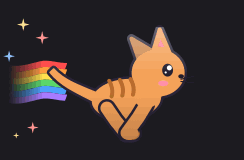

# RunTime

<p align="center">
  
</p>

macOS 메뉴바에서 러너가 달립니다. Claude Code로 토큰을 빨리 쓸수록 러너도 빨리 달리고,
러너를 누르면 5시간 세션 사용량과 주간 사용량을 보여 줍니다.

한도가 얼마나 남았는지 `/usage`를 쳐 보지 않아도, 메뉴바만 보면 지금 얼마나 쓰고 있는지 알 수 있습니다.

- 사용률은 Claude가 알려 주는 공식 값을 그대로 씁니다. 웹과 데스크톱 앱에서 쓴 양도 들어갑니다.
- 80%, 95%에 닿으면 러너가 지쳐 보이고 알림이 옵니다.
- 러너 22종 가운데 고르거나, 내 그림이나 [Petdex](https://petdex.dev) 펫을 러너로 쓸 수 있습니다.
- 러너를 데리고 장애물을 피하는 미니게임과 순위표가 있습니다.

Anthropic이 만든 앱이 아닌 개인 프로젝트입니다.

## 설치

macOS 13 이상, Claude Code에 로그인한 상태, Swift 툴체인이 필요합니다.
Swift가 없으면 먼저 `xcode-select --install`을 실행하세요.

```bash
git clone https://github.com/youminki/RunTime.git
cd RunTime
./install.sh
```

내 Mac에서 직접 빌드해 응용 프로그램 폴더에 넣고 바로 실행합니다. 빌드는 1~2분 걸립니다.
직접 빌드한 앱이라 "확인되지 않은 개발자" 경고는 뜨지 않습니다.

처음 한 번은 아래 창이 뜹니다.

| 창 | 누를 것 | 이유 |
| --- | --- | --- |
| 서명 인증서를 신뢰할지 묻는 로그인 암호 | 암호 입력 | 앱을 다시 빌드해도 키체인 허용이 풀리지 않게 서명용 인증서를 한 번 만듭니다 |
| "security가 키체인에 접근하려고 합니다" | **항상 허용** | Claude Code의 로그인 토큰으로 사용량을 조회합니다. "허용"만 누르면 다음에 또 묻습니다 |
| 알림 허용 | 허용 | 80%, 95% 알림에 씁니다 |

클론한 폴더는 지우지 마세요. 앱 안에서 업데이트할 때 이 폴더에서 다시 빌드합니다.

## 쓰는 법

### 메뉴바 러너

러너는 최근 1분 동안 쓴 토큰 양에 맞춰 움직입니다.

| 모습 | 분당 토큰 |
| --- | --- |
| 잠자기 | 5분 넘게 쓰지 않음 |
| 걷기 | 1 ~ 2,000 |
| 달리기 | 2,000 ~ 10,000 |
| 질주 | 10,000 ~ 30,000 |
| 전력 질주 (무지개 꼬리) | 30,000 넘게 |

설정의 민감도를 낮음으로 하면 기준이 두 배, 높음으로 하면 절반이 됩니다.

세션이나 주간 사용률이 80%를 넘으면 땀을 흘리며 앉고, 95%를 넘으면 빨갛게 바뀌고 느낌표가 깜빡입니다.
마우스를 올리면 지금 사용률이 툴팁으로 나옵니다. 러너를 누르거나 어느 앱에서든 ⌃⌥U를 누르면 사용량 창이 열리고, 오른쪽 클릭(또는 control 클릭)하면
일별 사용량, 순위, 새로고침, 설정, 업데이트 확인, 종료가 있는 빠른 메뉴가 뜹니다.

처음 설치하면 러너는 다른 앱 아이콘들의 오른쪽 끝(시계와 제어 센터 바로 왼쪽)에 놓이고, 로그인할 때 자동으로 켜집니다.
쓰는 법을 알려 주는 안내 창도 한 번 뜹니다. 자동 시작은 설정 > 일반에서 끌 수 있습니다.

메뉴바에는 기본으로 러너만 보입니다. 설정 > 일반에서 "메뉴바에 사용률 표시"를 켜면 러너 바로 옆에 사용률 숫자가 붙습니다.

### 사용량 창

러너를 누르면 열립니다.

```
┌───────────────────────────────────┐
│   러너가 달리는 무대      [순위] [게임] │
└───────────────────────────────────┘
고양이 · 달리는 중 ›                    [동작]
┌─────────────────┬─────────────────┐
│ 세션 5시간  빠름  │ 주간 7일    여유  │
│ 42 %            │ 18 %            │
│ ━━━━━━│───────  │ ━━━──│───────── │
│ 2시간 18분 뒤 초기화│ 목 16:44 초기화   │
│ 약 1시간 12분 뒤 한도│ Claude Code 92% │
└─────────────────┴─────────────────┘
┌───────────────────────────────────┐
│ 최근 30분                 최고 62K/분 │
│ ∿∿∿∿∿∿∿∿∿∿∿∿∿∿∿∿∿∿∿∿∿∿∿∿∿∿∿∿∿∿∿∿∿ │
│ ─────────────────────────────────  │
│   오늘     │   추정 비용   │  지금 속도  │
│ 3.1M 토큰 │   $12.40    │   8K /분   │
└───────────────────────────────────┘
● 공식 사용량 · 2분 전 갱신        ▥  ↻  ⚙  ⏻
```

- 이름 옆 배지는 지난 시간에 견준 사용 속도입니다. 사용률이 지난 시간 비율보다 10%p 넘게 앞서면 빠름, 뒤처지면 여유,
  95%를 넘으면 한도 임박입니다. 최근 속도로 초기화 전에 한도에 닿을 것 같으면 빠름으로 올라갑니다.
- 막대 위의 흰 눈금은 시간이 얼마나 지났는지입니다. 막대가 눈금보다 앞서 있으면 시간보다 빨리 쓰고 있다는 뜻입니다.
- "약 1시간 12분 뒤 한도"는 최근 30분 동안 오른 속도로 계산합니다. 초기화가 먼저 오면 "초기화 전까지 여유"로 나옵니다.
- 주간 아래에는 어디서 썼는지(Claude Code, 채팅 등) 비율이 나옵니다.
- 최근 30분 그래프에 마우스를 올리면 그 분에 쓴 토큰이 나옵니다.
- 오늘 토큰, 예상 비용, 지금 속도는 이 Mac의 Claude Code 기록으로 셉니다. 비용은 API 단가로 계산한 참고값입니다.
- 아래 단추는 왼쪽부터 일별 사용량, 새로고침, 설정, 종료입니다. 일별 사용량 창에는 하루 평균과 날짜별 막대, 평균선이 나옵니다.
- 무대의 러너를 누르면 장난을 치고, 메뉴바 러너도 같이 따라 합니다. 오른쪽 "동작"에서 고른 동작도 무대와 메뉴바 러너가 함께 합니다.

사용률이 `--`로 나오면 공식 값을 받지 못한 것입니다. 이유는 창 아래 상태 줄에 나옵니다.
이때는 추정값을 보여 주지 않고 비워 둡니다. 속도와 오늘 사용량은 계속 보입니다.

### 러너 바꾸기

사용량 창에서 러너 이름(`고양이 ›`)을 누르면 사용량 자리에 러너 목록이 열립니다. 위 무대에서 고른 러너가 바로 달리고,
아래에서 색상을 바꾸거나 "아무거나"로 무작위로 고를 수 있습니다. 설정 > 러너에서도 고를 수 있습니다.

- 기본 러너 22종: 고양이, 강아지, 토끼, 여우, 펭귄, 오리, 공룡, 고슴도치, 병아리, 개구리, 판다, 거북이,
  달팽이, 문어, 고래, 유령, 슬라임, 로봇, UFO, 닌자, 유니콘, 드래곤
- 내 그림: "그림 불러오기"로 GIF나 PNG 여러 장(파일 이름 순서)을 넣으면 바로 러너가 됩니다. 배경은 자동으로 지웁니다.
- Petdex: "Petdex에서 찾기"로 수천 개의 펫을 검색합니다. `shinchan`, `doraemon`처럼 영어나 원어 이름으로 찾아야 잘 나옵니다.
  펫은 사용자가 올린 팬아트라서 개인적으로만 쓰세요.
- 색상 9종(자동, 본래 색, 주황, 하늘, 분홍, 초록, 보라, 노랑, 무지개)과 메뉴바 크기 3단계(작게·보통·크게)를 고를 수 있습니다.
  메뉴바가 좁으면 "작게"를 고르세요. 러너 칸이 54pt에서 39pt로 줄어듭니다.

### 미니게임과 순위

무대 오른쪽 위의 게임 단추를 누르면 시작합니다.

- 스페이스, ↑, W, 클릭으로 점프합니다. 길게 누를수록 높이 뜁니다.
- ↓나 S로 숙여서 날아오는 장애물을 피합니다.
- ←→나 A·D로 앞뒤로 움직입니다. 앞으로 나가면 코인을 먼저 먹지만 장애물을 볼 시간이 줄고, 뛰는 중에 →를 누르면 더 멀리 넘습니다.
- esc로 나갑니다.

갈수록 빨라지고, 최고 점수는 이 Mac에 남습니다.

트로피 단추를 누르면 전체 순위와 이번 주 순위가 나옵니다.

- 게임 중에는 내 최고 점수보다 높은 사람이 차례로 다음 목표로 뜨고, 그 점수를 넘으면 "추월!" 배너가 나옵니다.
- 새 1위가 나오거나 1위가 기록을 깨면 러너가 말풍선으로 알려 줍니다.

순위표 창에서 "순위에 참여"를 켜고 닉네임을 정하면 내 점수도 순위에 올라갑니다. 참여는 기본으로 꺼져 있습니다.
참여하면 누가 나를 추월했을 때나 내가 1위가 됐을 때도 알려 주고, 사용량 창이 닫혀 있던 동안 생긴 소식은 다음에 열 때 들려줍니다.
"내 기록 지우기"로 서버에서 내 기록을 지울 수 있습니다.

### 설정

설정은 사용량 창 오른쪽 아래의 톱니바퀴 단추로 엽니다. 위쪽에서 구역을 고릅니다.

| 구역 | 내용 |
| --- | --- |
| 일반 | 로그인 시 자동 시작, 단축키(⌃⌥U)로 사용량 열기, 메뉴바에 사용률 표시(켜면 세션·주간·높은 쪽 중 고름), 업데이트, 버전, Claude Code 기록 폴더 열기, GitHub 저장소 |
| 러너 | 러너 고르기(이름 검색), 메뉴바 크기(작게·보통·크게), 색상, 움직임(절약·부드럽게·최고), 가끔 혼자 장난치기 |
| 사용량 | 공식 사용량 연동과 상태, 민감도, 기록 확인 주기(1·3·5·10초), 한도 임박 알림(80%, 95% 각 1번), 세션·주간 초기화 알림, 알림 보내 보기 |

### 업데이트

앱이 6시간마다 새 버전이 있는지 확인합니다. 새 버전이 있으면 러너가 말풍선으로 알려 줍니다.
설정 > 정보에서 "지금 업데이트"를 누르면 클론한 폴더에서 새 코드를 받아 다시 빌드하고 앱을 새로 띄웁니다.

- 다시 빌드하는 1~2분 동안은 메뉴바에서 러너가 사라졌다가 새 버전으로 다시 나타납니다.
- "자동으로 업데이트"를 켜면 묻지 않고 업데이트합니다. 게임 중에는 기다렸다가 사용량 창이 닫혀 있을 때 합니다.
- 클론한 폴더에서 파일을 고쳤거나 다른 브랜치에 있으면 덮어쓰지 않고 이유를 보여 줍니다.
- 포크해서 설치했다면 그 포크의 새 커밋을 따라갑니다.
- 빌드가 실패하면 쓰던 앱이 그대로 남고, 자동 업데이트는 실패한 버전을 다시 시도하지 않습니다. 로그는 `~/Library/Logs/RunTime/update.log`에 있습니다.
- 터미널에서 직접 하려면 클론한 폴더에서 `git pull --ff-only && ./install.sh`를 실행하세요.

### 다시 켜기와 지우기

- 다시 켜기: Spotlight에서 RunTime을 찾거나 `open -a RunTime`. 로그인할 때마다 켜려면 설정 > 일반에서 "로그인 시 자동 시작"을 켭니다.
- 지우기: 응용 프로그램 폴더에서 `RunTime.app`을 지웁니다. 설정과 기록까지 지우려면 아래도 실행하세요.

```bash
defaults delete dev.runtime.RunTime
rm -rf ~/Library/Application\ Support/RunTime ~/Library/Logs/RunTime
```

## 자주 묻는 것

**키체인 암호를 계속 물어요.**
창이 뜰 때 "허용" 대신 "항상 허용"을 누르세요. `~/.claude/.credentials.json` 파일이 있으면 키체인보다 그 파일을 먼저 읽어서 창이 뜨지 않습니다.

**메뉴바에서 러너가 안 보여요.**
화면이 좁고 앞에 있는 앱의 메뉴가 길면 macOS가 메뉴바 항목을 왼쪽부터 « 안으로 숨깁니다.
install.sh는 처음 설치할 때 러너를 오른쪽 끝에 두어 가장 늦게 숨게 합니다. 그래도 숨으면 ⌘를 누른 채
러너를 « 단추 오른쪽으로 끌어 두세요. macOS가 그 자리를 기억하고, 업데이트해도 옮기지 않습니다.

**`/usage`와 숫자가 달라요.**
공식 값은 3분마다 받아서 최대 3분까지 늦을 수 있습니다. 사용량 창을 열거나 ↻를 누르면 바로 다시 받습니다.

**예전 이름 TokenCat으로 설치했어요.**
업데이트하거나 `./install.sh`를 다시 실행하면 옛 앱을 지우고 `RunTime.app`을 설치합니다.
설정, 최고 점수, 순위 참여 정보, 내 러너와 받은 펫, 로그인 시 자동 시작은 새 앱이 처음 켜질 때 옮겨 옵니다.
알림 허용은 한 번 더 묻습니다. 옛 설정(`dev.tokencat.TokenCat`)은 지우지 않으니 필요 없으면
`defaults delete dev.tokencat.TokenCat`로 지우세요.

## 무엇을 어디로 보내나

| 보내는 곳 | 언제 | 보내는 것 |
| --- | --- | --- |
| Anthropic | 3분마다 | Claude Code 로그인 토큰으로 사용률 조회 |
| 순위 서버 | 순위에 참여했을 때 | 무작위 설치 ID, 닉네임, 그리고 최근 7일 기록을 넘은 판의 점수, 코인 수, 플레이 시간, 앱 버전 |
| 순위 서버 | 사용량 창이나 순위표 창이 열려 있을 때 30초마다, 참여 중이면 10분마다 | 참여 전에는 없음 (공개 순위만 받음). 참여 중에는 내 순위를 알려고 설치 ID를 함께 보냄 |
| petdex.dev | Petdex에서 찾기를 열었을 때 | 없음 (펫 목록과 그림만 받음) |
| GitHub | 6시간마다 | 없음 (공개 저장소의 커밋 비교만 받음) |

로그인 토큰은 읽기만 하고, Anthropic 말고는 어디에도 보내지 않으며 디스크나 로그에 남기지 않습니다.
키체인을 자동으로 열거나 암호를 저장하지도 않습니다.

## 한계

- 사용률은 Anthropic이 공식으로 안내하지 않은 방식으로 받습니다. 이 방식이 바뀌거나 막히면 사용률은 `--`로 비고 속도와 오늘 사용량만 보입니다.
- 키체인은 Apple의 `/usr/bin/security`로 읽습니다. 그래서 다시 빌드해도 다시 묻지 않지만,
  "항상 허용"을 누른 뒤에는 다른 프로그램도 같은 방법으로 이 토큰을 읽을 수 있습니다.
- Agent SDK나 `claude -p`로 쓴 양은 한도가 따로라서 기록에 SDK 표시가 있으면 따로 보여 줍니다. 표시가 확실하지 않아 추정입니다.
- 움직임이 많은 Petdex 펫은 메뉴바 칸(30px 안팎)에서 뭉개져 보일 수 있습니다.

## 개발

```bash
swift run RunTime             # 빌드하지 않은 채 개발 실행 (알림과 자동 시작은 동작하지 않음)
./scripts/test.sh             # 테스트 103개
scripts/build-app.sh          # dist/RunTime.app과 dmg 만들기
```

설계 결정, 측정값, 트러블슈팅 기록은 [개발 기록](docs/development.md)에 모았습니다.

<details>
<summary>점검용 실행 옵션과 순위 서버</summary>

`.build/debug/RunTime` 뒤에 붙여 실행합니다.

| 옵션 | 하는 일 |
| --- | --- |
| `--report` | 집계를 ccusage와 비교 |
| `--sprite-sheet <폴더>` | 모든 러너의 동작을 시트로 저장 |
| `--menubar-audit <폴더> [화면 배율] [메뉴바 높이] [크기 배율]` | 메뉴바 칸에서 잘림, 키, 어두운 윤곽을 `report.tsv`와 시트로 저장 |
| `--game-shots <폴더> [러너 id]` | 미니게임을 자동으로 플레이하며 장면을 PNG로 저장 |
| `--hero-gif <파일>` | README 맨 위 GIF 만들기 |
| `--ui-shots <폴더>` | 팝오버, 설정 구역, 일별 사용량, 순위표를 실제 데이터로 찍어 PNG로 저장 |

진단 로그는 `log stream --predicate 'subsystem == "dev.runtime.RunTime"' --level debug`로 봅니다.

순위 서버는 `server/leaderboard/`에 있습니다(Cloudflare Workers + D1).

```bash
cd server/leaderboard
npm test                 # 규칙 테스트
npm run dev              # 로컬 서버를 띄운 뒤, 다른 터미널에서
node test/e2e.mjs        # 통합 테스트
npx wrangler@4 login && ./deploy.sh
```

내 Mac에서만 쓸 러너는 `Sources/RunTime/LocalPack/`에 두면 됩니다. 이 폴더는 git이 무시합니다.
`LocalRunnerPack`을 따르는 `@objc(RunTimeLocalPack)` 클래스를 두면 그 Mac에서 빌드한 앱에만 들어갑니다.

</details>

## 출처와 라이선스

- 메뉴바 러너는 [RunCat](https://kyome.io/runcat/)에서, 무지개 꼬리는 냥캣에서 아이디어를 얻었습니다. 러너 그림은 모두 직접 그렸습니다.
- 미니게임의 장애물 간격과 속도 규칙은 [Chromium T-Rex Runner](https://chromium.googlesource.com/chromium/src/+/main/components/neterror/resources/)(BSD 3-Clause)를 따랐습니다.
- 미니게임 그림과 효과음은 Kenney의 [Pixel Platformer](https://kenney.nl/assets/pixel-platformer)와 [Digital Audio](https://kenney.nl/assets/digital-audio)(CC0)입니다.
- 집계 규칙은 [ccusage](https://ccusage.com/guide/blocks-reports)를 참고했습니다.

MIT 라이선스입니다. Anthropic, Claude와 관계없는 비공식 도구입니다.
